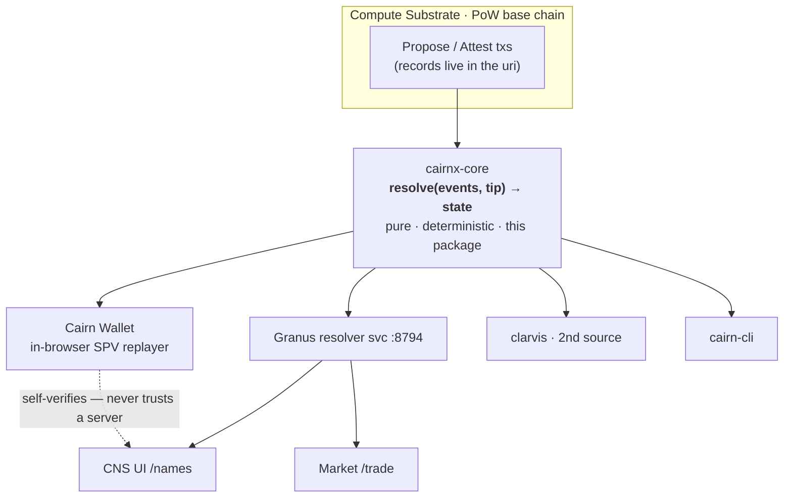
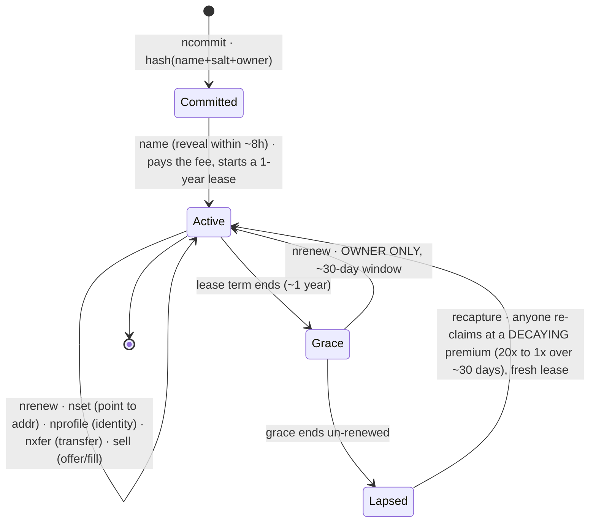
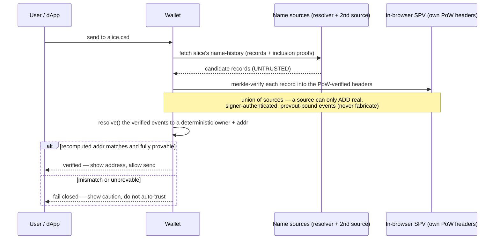
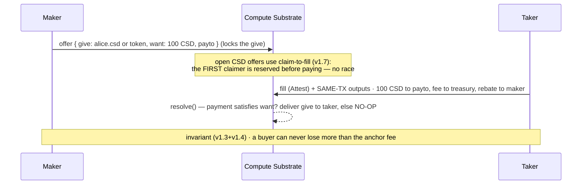

# @inversealtruism/cairnx-core

**CairnX** is the application layer of [Compute Substrate](https://cairn-substrate.com/docs) (CSD): an
on-chain **name service (CNS / `.csd`)**, **tokens**, and **atomic delivery-versus-payment trades** —
implemented as a **pure deterministic convention** over the chain's native `Propose`/`Attest`
transactions. No fork, no smart contracts, no custodian. The same trust class as Bitcoin
Ordinals/Runes/BRC-20 — stated plainly, and engineered to be byte-for-byte reproducible.

> **First product shipping: CNS — the Cairn Name Service.** `alice.csd` is an on-chain-native, leased,
> tradeable identity. This README leads with how CNS works, then covers tokens and trades.

Live: market **[/trade](https://cairn-substrate.com/trade)** · names **[/names](https://cairn-substrate.com/names)** · explorer **[/explorer](https://cairn-substrate.com/explorer)**
Normative spec: **[`CONVENTION.md`](./CONVENTION.md)** (shipped in this package) · Conformance bar: **[`test/vectors/`](./test/vectors)**

> Diagrams below render on GitHub (Mermaid). The ASCII architecture map renders everywhere.

---

## 1 · The one idea: a pure deterministic overlay

Compute Substrate is a proof-of-work chain that does one thing: it **records** signed `Propose` /
`Attest` transactions and orders them. It does **not** know what a "token" or a "name" is. CairnX gives
those records *meaning* by replaying them through a single pure function:

```
resolve(events, tipHeight)  →  canonical state   (tokens · names · offers · bids · balances)
```

**Determinism is the trust model.** Every honest party that replays the same chain prefix MUST produce
**byte-identical** canonical state. There is no privileged server — your wallet computes the same answer
the operator's resolver does, and disagreement is detectable.

```
┌──────────────────────────────────────────────────────────────────────────────┐
│  APP SURFACES        CNS UI (/names)   ·   Market (/trade)   ·   Cairn Wallet  │
│                      Explorer          ·   cairn-cli         ·   3rd-party dApps│
└───────────────▲───────────────────────────────────────────────▲──────────────┘
                │ read derived state                              │ build + sign records
┌───────────────┴───────────────────────────────────────────────┴──────────────┐
│  cairnX OVERLAY  =  resolve(events, tip) → state   (THIS PACKAGE)               │
│  every replayer runs the SAME pure function and gets the SAME bytes:            │
│     wallet (SPV, in-browser)  ·  Granus resolver svc  ·  clarvis  ·  cli        │
└───────────────▲────────────────────────────────────────────────────────────────┘
                │ events (Propose/Attest) + block headers
┌───────────────┴────────────────────────────────────────────────────────────────┐
│  COMPUTE SUBSTRATE (base chain)   PoW · records & orders txs · enforces same-tx  │
│                                   payment atomicity & expiry — decides NOTHING   │
└──────────────────────────────────────────────────────────────────────────────────┘
```

**The safety consequence of "overlay":** CairnX names and tokens have **no native-CSD backing**. A bug,
an over-mint, or even a fully-lying indexer can only fork the *overlay view* of whoever trusts it — it
**cannot move CSD**. CSD moves *only* via real same-transaction payment outputs, which the chain makes
atomic with the fill and which a buyer's wallet verifies against the offer's terms before paying. This
single decision bounds the blast radius of every overlay bug and is why the names/tokens alpha is
funds-safe.



---

## 2 · CNS — the Cairn Name Service (`.csd`)

CNS is an **ENS-class** namespace native to Compute Substrate. A name like `alice.csd` is owned by an
address, **leased** (not sold forever), points to an address, and carries an optional profile — all as
plain on-chain records, all resolvable by replay.

- **Names are lowercase-ASCII only** (`^[a-z0-9](?:[a-z0-9-]{0,30}[a-z0-9])?$`, 1–32 chars). This kills
  the homograph/confusable phishing class outright — there is no unicode look-alike attack surface.
- **The `.csd` suffix is presentation, not consensus.** The on-chain record stores the *bare* name
  (`alice`); the UI renders `alice.csd`. The CNS rebrand and any display-suffix change are **UI-only** —
  they do not touch the resolver or chain history.
- **Reserved names** (`csd`, `treasury`, `admin`, `official`, `root`, `www`, `support`) can never be
  registered — anti-impersonation, enforced in consensus.

### 2.1 · Lifecycle



1. **Commit → Reveal (registration).** You first publish `ncommit` — a hash of `{name, salt, owner}`.
   Then within ~8 hours you publish the `name` record revealing the name. The resolver **back-dates** the
   registration to the commit height, so a front-runner who copies your reveal loses the ownership race.
   Standard commit-reveal, enforced deterministically.
2. **Active lease (~1 year).** You own the name: point it at an address (`nset`), set an identity profile
   (`nprofile`), transfer it (`nxfer`), renew it (`nrenew`), or list it for sale.
3. **Grace (~30 days).** When the term ends, **only the current owner** may renew during a grace window —
   your name is never sniped out from under you while you still hold it.
4. **Lapsed → decaying-premium recapture.** If grace passes un-renewed, anyone may re-claim, but at a
   **premium that decays 20× → 1×** over ~30 days (a Dutch auction back to the floor price). This prices
   in genuine demand without a permanent squatting tax, and a recaptured name gets a fresh ownership basis
   so a stale pre-lapse commit can't steal it.

### 2.2 · The records

| Record | What it does |
|---|---|
| `ncommit` | Commit to a name (hash of name+salt+owner) — opens the front-run-safe reveal window |
| `name` | Reveal + claim (registration) — pays the fee, starts/refreshes the lease |
| `nrenew` | Extend the lease (owner-only in grace) |
| `nxfer` | Transfer ownership to another address |
| `nset` | Set the forward address record (`alice.csd → 0x…`) |
| `nprofile` | Owner-set identity metadata (ENSIP-5-style keys: avatar, url, com.twitter, …) |

### 2.3 · Parameters

| Parameter | Value | Notes |
|---|---|---|
| Lease term | ~1 year (`NAME_TERM_EPOCHS = 8760`) | 1 epoch ≈ 1 h (30 blocks) |
| Grace window | ~30 days (`NAME_GRACE_EPOCHS = 720`) | owner-only renewal |
| Recapture premium | **20× → 1×** over ~30 days | decaying Dutch auction on lapsed names |
| Reveal window | ~8 h (`COMMIT_MAX_BLOCKS = 240`) | commit-reveal deadline |
| Registration fee | **6.7 CSD** (≤4 chars) · **3 CSD** (≥5 chars) | flat 2-tier (v1.8); paid to the treasury |

### 2.4 · How a name resolves — and what's actually *verified*

This is what makes CNS trust-minimized rather than "ask a server." When the wallet resolves `alice.csd`
to choose a send recipient, it does **not** trust the resolver's answer — it independently SPV-verifies
every relevant record into the proof-of-work chain it built itself, replays them, and only trusts the
deterministically-recomputed winner.



- **Forward resolution (`name → address`, the funds path) is SPV-verified and fail-closed.** The wallet
  treats the resolver as untrusted, merkle-binds each record to a PoW header, replays, and refuses the
  send if its recomputed answer disagrees or can't be proven. It re-checks again at signing time and
  refuses both an address change and a verification-status regression.
- **Reverse resolution (`address → primary name`, a display label) is server-trusted.** It is never a send
  target — an identity badge only — so it is cheaper and clearly bounded as "unverified label."
- **Ownership has an unambiguous total order:** lowest `(effectiveHeight, position, ordinal-id)` wins, with
  a paid market-fill (`viaFill`) immune to displacement. Exactly one owner per name at every height.

> **Note on bought names:** a name you *register* is fully SPV-verifiable today. A name acquired via a
> *market fill* is displacement-immune and correctly resolved, but its forward resolution currently shows
> a caution rather than a green check (the wallet fails *closed* on this class) pending a resolver change
> that makes name-fills name-local. Registration — the alpha's primary flow — is unaffected.

---

## 3 · Tokens

Fungible tokens, same overlay model. A `deploy` declares a ticker; `mint` issues supply (capped by the
declared supply and, for open mints, a per-tx limit); `transfer` moves balances; `tmeta` attaches issuer
metadata. Because tokens are an overlay, an over-mint can only inflate *that token's* overlay view — it
can never touch CSD.

| Record | What it does |
|---|---|
| `deploy` | Create a token: `ticker`, `decimals` (0–8), `supply`, `mint: "open" \| "issuer"`, optional `mintLimit` |
| `mint` | Issue supply (≤ declared supply; open mints bounded per-tx by `mintLimit`) |
| `transfer` | Move a balance to another address (optional memo) |
| `tmeta` | Issuer-set token metadata (via the content layer) |

---

## 4 · Atomic delivery-versus-payment (DvP) trades

Sell a token **or a name** for CSD or another token, atomically. The offer locks the give-side in the
resolver; the fill is an `Attest` whose **same transaction carries the payment outputs** — the chain makes
payment and delivery one indivisible step. No escrow, no custodian, no "the other side didn't pay."



Highlights: partial fills (pro-rata, maker-favoring), bids (RFQ buy-side intents), `ocancel` (maker's mass
kill-switch), a 1.5% taker fee + maker rebate on resting liquidity (v1.6), and the **claim-to-fill** open
lane (v1.7) that reserves an untaken CSD offer for the first claimer so two buyers can't race into a burned
payment. Listing duration is a **UI policy** (consensus places no cap as of v2.2) — long-rester inventory
is bounded in the light client, not the chain.

---

## 5 · How it's built (and why you can trust the replay)

- **One pure fold.** `resolve()` rebuilds *all* state from the event log every call — reorg-safe by
  construction. Integer-only math (BigInt, ceil-rounded fees), one ordinal string comparator, sorted
  iteration at every materialization, **no `Date`/`Math.random`/float in any value path**.
- **A fail-closed parse gate.** `parseRecord` validates every record type with `onlyKeys` allow-lists, a
  recursive well-formed-UTF-16 check, and `Number.isSafeInteger` guards — closing real cross-language
  canonicalization fork classes (astral-decoy keys, lone surrogates, the 2⁵³/`1e21` JSON trap). Invalid
  input is always a no-op, never a throw that poisons replay.
- **Non-retroactive height-gated eras.** Every change activates at a `V*_HEIGHT` and is **byte-identical
  below that gate** — history is never reinterpreted. Relaxations key on the offer's *anchor* height so a
  mixed-version fleet can't fork during a rollout.
- **The determinism contract is *enforced*, not asserted.** An independent Python reference
  (`conformance/cairnx_ref.py`) runs the same corpus and a 1500-iteration JS↔Python differential fuzzer on
  every CI run, plus 60 language-neutral vectors and pinned live-chain replay hashes.

### Version history (activation heights are consensus-grade — never reinterpret history)

| Version | Height | What |
|---|---|---|
| v1.0 / 1.1 | 29 860 / 29 960 | tokens · **names (CNS)** + protocol fees |
| v1.2 | 30 300 | token⇄token swaps · partial fills · bids (RFQ) · `ocancel` |
| v1.3 / 1.4 | 31 100 / 31 400 | CSD-priced offers taker-bound · fill-before-cancel — *buyer can't lose more than the anchor fee* |
| v1.5 | 32 000 | **name leasing** (renew / grace / decaying-premium recapture) · `tmeta` |
| v1.6 | 33 600 | taker fee 1% → 1.5% + maker rebate on resting liquidity |
| v1.7 | 34 000 | claim-to-fill — race-safe open CSD offers |
| v1.9 | 36 700 | `nprofile` — ENS-class identity on a name |
| v2.0 | 38 400 | bounded claim grace (the late-fill fix) |
| v1.8 | 40 000 | flat two-tier name fee (6.7 / 3 CSD) |
| v2.1 | 40 100 | offer/bid duration cap (`MAX_OFFER_EPOCHS = 168`) — *superseded by v2.2* |
| v2.2 | 41 300 | duration cap **removed from consensus** → UI policy; bound moves to the light client |

### Package layout

`src/resolve.ts` (the ledger) · `src/records.ts` (the parse/validate gate) · `src/types.ts` (constants +
height-gated client selectors) · `src/client.ts` (reorg-safety helpers a payer applies) · `CONVENTION.md`
(normative spec, §1–§24) · `test/vectors/` (portable conformance corpus).

### Use it

```ts
import { resolve, canonicalState, offer, nameCommit, DOMAIN } from "@inversealtruism/cairnx-core";
import { buildPropose } from "@inversealtruism/csd-tx";

// BUILD a record (e.g. a partially-fillable sell offer, reserved for one buyer — v1.3 RFQ)
const built = offer({ give: { ticker: "CAIRN", amount: "5000000000" },
                      want: { value: "100000000" }, min: "10000000", taker: buyerAddr });

// ANCHOR it (the record IS the uri; same-tx outputs can pay fees/sellers — atomic DvP)
const tx = buildPropose({ domain: DOMAIN, uri: built.uri, payloadHash: built.payloadHash,
  expiresEpoch, fee: 25_000_000, utxos, priv });

// RESOLVE the chain (events come from any indexer; see the Scanner reference impl)
const state = resolve(events, tipHeight);
console.log(state.names, state.tokens.CAIRN, state.balances.CAIRN);
```

### Write a conformant resolver in another language

1. Implement `CONVENTION.md` §1–§24 (apply order, every record type, the `V*_HEIGHT` activations, the
   canonical-state format — ordinal key ordering, data surface only).
2. Replay `test/vectors/cases.json`: your canonical state must equal `expectedState` **byte-for-byte**.
3. Replay the live chain and compare `sha256(canonicalState)` against `test/vectors/replay-hashes.json`.

---

## 6 · ★ Single source of truth — change consensus without drift

**This package is the ONE canonical implementation of the CairnX convention.** Every consumer **imports**
its constants / regexes / fee+claim+expiry math / `canonicalJson` / `parseRecord` from here (via npm, or a
*deterministic vendored esbuild* of this exact dist where a browser/MV3 constraint forbids a runtime dep
tree). **Nothing re-declares a consensus value by hand** — a hand-mirror that drifts across a version bump
is a silent chain fork, the exact bug class the shared-core de-dup (`cairn/docs/Plans/46`) deleted.

| Consumer | How it gets consensus | Guard |
|---|---|---|
| **cairnx svc** (`cairnx/`, the live resolver `:8794`) | npm pin → re-export shim | svc replay-hash conformance |
| **cairn /trade + /names UI** (browser) | `public/vendor/cairnx-core.js` (esbuild of this dist) | `vendor-cairnx-parity.test.mjs` + `check-vendor-fresh.mjs` |
| **cairn-wallet** (MV3, fund custody) | `src/vendor/cairnx-spv.js` (esbuild, `export *`) | `test/cairnx.ts` + `check-vendor-fresh.mjs` + `PROVENANCE.json` |
| **cairn-cli** | npm pin → imports regexes/limits | `test/cairnx.mjs` |
| **the Python oracle** `conformance/cairnx_ref.py` | INDEPENDENT re-implementation (the differential — **KEEP**) | `test:crosslang` (JS⇄Python) |

**To make a consensus change:** edit `src/` here **and** `conformance/cairnx_ref.py`; add a height-gated
`V*_HEIGHT` (never reinterpret history) + a vector; `pnpm build && pnpm test && pnpm test:crosslang &&
node scripts/check-lockstep.mjs` (all green); **bump the version**; `pnpm publish`; **rebuild + recommit
the two vendored bundles**; re-pin every consumer and deploy them **between** activation heights, not
across one (below the gate the output is byte-identical, so the rollout is fork-free).

**KEEP-list (verification, not duplication — never collapse):** the Python oracle, the wallet/swapguard SPV
light-client + `namespv.ts`, the wallet `core/csdtx.ts` tx-codec twin, the portable vectors.

---

### Honest limits (read these)

- **Trust-min is operator-shaped today.** Completeness/availability rests on a single indexer and a
  2-source name union whose two defaults share one apex — strong against *fabrication* (every event is
  SPV/signer/prevout-bound), weaker against *withholding* until a genuinely independent second source runs.
  The 2nd-indexer canonical-hash comparator is designed but parked until that exists.
- **The indexer ships on SQLite by default.** A Postgres backend is fully built (`csd-indexer/src/db.ts`)
  and is a documented env-flip + from-genesis-replay cutover (`RUNBOOK-HOST.md §8.3`) — the scale path, not
  yet the running default.
- **`verifyInclusion` (merkle-binding the indexer's decoded outputs) is OFF by default** and is a hard
  prerequisite before any lane treats received CSD as spendable. The overlay model is what keeps the
  names/tokens alpha funds-safe regardless.

MIT · the same trust class as Ordinals/Runes, engineered for byte-for-byte reproducible replay.
